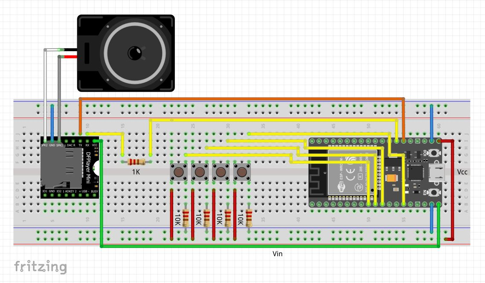

# Power Plant

Music player built on top of DFPlayer Mini and ESP32 to play music during the day and white noise during the night

## Tools and components

- 1 ESP32 + Cable
- 1 DFPlayer Mini + 1 micro SD
- 4 push buttons
- 4 10Komhs resistors (pull-up)
- 1 1k ohms (tx-rx)
- Some wires and a breadboard

## How does it work ?

The DFPlayer Mini is an autonomous MP3 player which can communicate with ESP32 by Serial and play music directly to a speaker. 
On startup, the DFPlayer loads the mp3 files available on the SD Card and start playing the white noise mp3 located on the 001 folder.

During the night mode, it will only play white noise at the volume you want. During the day mode, you can set the volume AND switch to next song. This was designed to prevent you to accidentally play music out loud during the night ;)

By pressing on the buttons you can:

- Play/Pause the music or white noise
- Increase the volume
- Decrease the volume
- Play the next song (only on the day mode). If you press the button for more than 1 second, you can switch mode (night/day).

## Circuit

If you want to open the circuit schema as an interactive board, download the Fritzing software and open schema.fzz !
